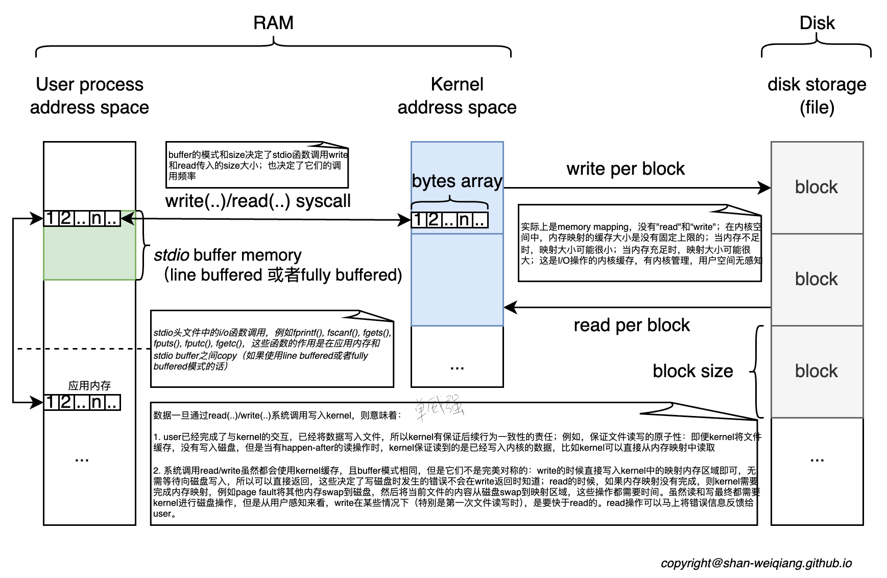

本篇文章解释I/O缓存机制。Linux I/O缓存分从外设到kernel之间的I/O缓存，称为kernel缓存；以及`stdio` C库到kernel之间的I/O缓存，称为`stdio`缓存。

* toc
{:toc}

# I/O缓存原理图

# usr缓存

usr缓存即C系统库`stdio`的缓存，由于这个缓存的存在，会造成用户的期望和实际程序行为的不一致，所以理解这个缓存对写出符合期望的程序是很有用的。从原理图上就可以看出`stdio`的缓存最根本的影响就是：用户调用`stdio`做I/O，跟kernel实际接收到I/O请求是不同步的。这个落差就是用户以为做了I/O，但是kernel确还没收到请求。`stdio`会将用户的I/O数据首先copy到缓存区域，根据`stdio`的模式来进行与kernel的交互，即syscall。无论读写，`stdio`有三种缓存模式：

- IONBF: 没有缓存，所有的`stdio`调用都直接调用`write/read` syscall，相当于透传；默认情况下`stderr`是这个模式
- IOLBF: Line buffered, 行缓存，即每当读，或者写遇到`\n`换行符时，`stdio`函数才会调用`write/read`系统调用，每次读写一行。如果读写的文件描述符是一个pty设备，模式是此模式
- IOFBF: Fully buffered，全缓存，即根据用户设置或者默认的缓存大小进行缓存，只有到缓存满时，`stdio`的函数才会调用`write/read`系统调用进行kernel的读写操作；一般磁盘文件读写模式这个模式

## 设置缓存模式

`setvbuf`用于设置一个文件描述符的缓存模式：

- 每个文件描述符有自己的IO缓存模式
- `setvbuf`的设置会影响`stdio`中所有的函数对当前文件描述符的缓存模式
- 必须在当前文件描述符使用任何`stdio`函数前调用`setvbuf`

## flush缓存

根据一个流文件的打开方式，一个流可以是只读的；可以是只写的；也可以是可读可写的：

- 如果是只读的，则流文件需要一个`stdio`的read缓冲区
- 如果是只写的，则流文件需要一个`stdio`的write缓冲区
- 如果是可读可写的，C标准并没有定义是否需要为读和写分别分配缓冲区，还是使用同一个缓冲区；不过C标准规定了一些规则：
  - 写操作后不能直接跟读操作，中间必须有`fflush`， `fseek`, `fsetpos`或者`rewind`，这些操作的特点是都会清空缓存区域
  - 读操作后不能直接跟写操作，中间必须有`fseek`, `fsetpos`或者`rewind`，除非读操作读到的是EOL，此时表示文件是空的，所以是不需要读缓冲区的
  - 以上两点规定间接的定义了读和写的缓冲区的设计，只要满足了以上的标准要求，系统实现时读和写可以使用同一个缓冲区，当然也可以实现不同的缓冲区
  - 上面的规则是为了保证在应用层`stdio`读写操作的**原子性**，虽然在kernel中对一个文件的读写是原子的，但是`stdio`的读写不是原子的，如果要保证原子性，就必须在读和写之间有一个类似**读写屏障**的机制，即读和写在`stdio`层也是原子的

需要强调的是，一个流只有在使用了`stdio`时，编译器才会分配相关的缓冲区。

`fflush`用于主动刷新缓存区：

- 如果不传入任何文件描述符，这个函数刷新所有`stdio`的缓冲区
  - 每个流都有自己的`stdio`函数缓冲区，缓冲区是跟流挂钩的
- 如果流是只读的，`fflush`的作用是清空缓冲区
- 如果流被关闭，`fflush`会自动被调用
  - 这里说明如果流是可读可写的，且实现采用了单一缓存，`stdio`肯定要知道当前缓存中存储的是读还是写的缓存，不然流关闭时无法决定相应的操作
