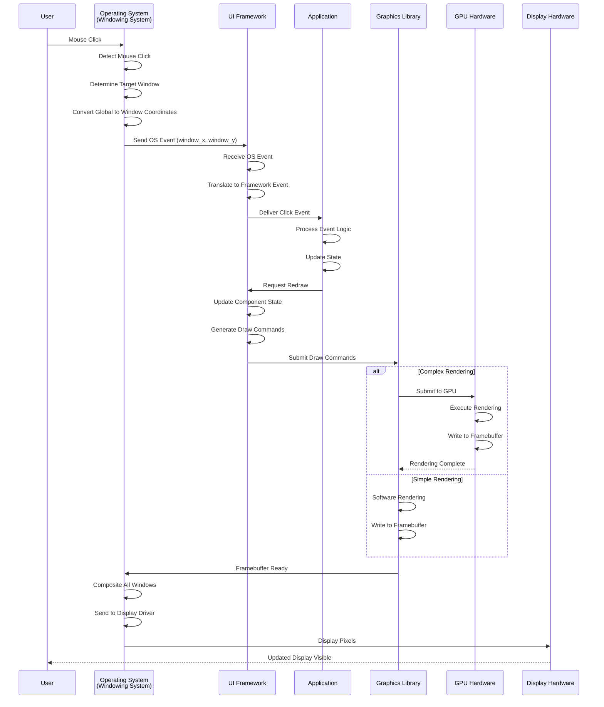
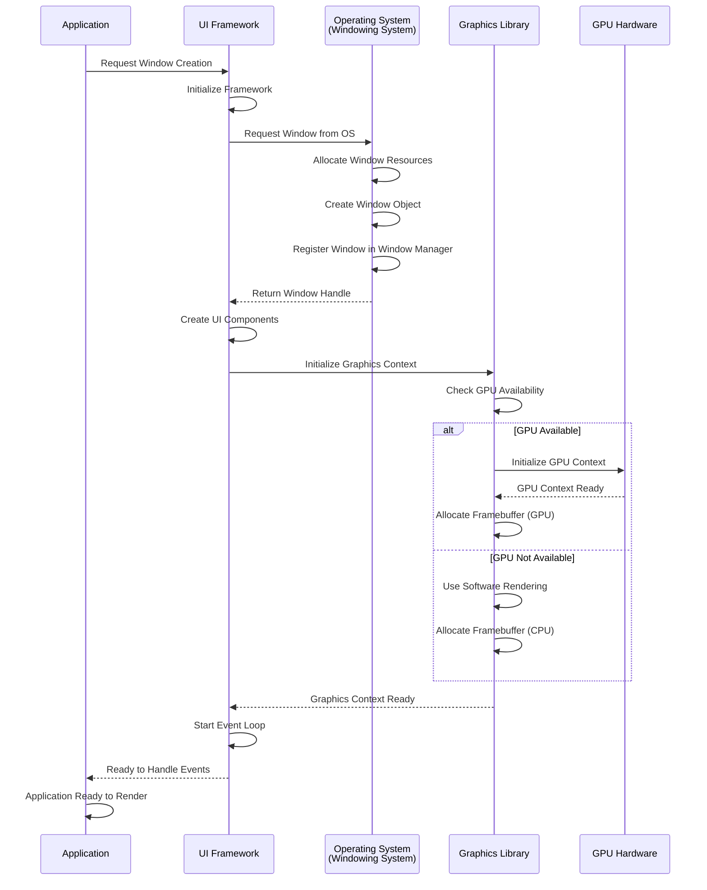

Modern computer graphics involve a complex software stack that orchestrates multiple layers of abstraction, from the operating system's windowing system to the final pixel output on the monitor. Understanding this stack is crucial for developers working with graphics applications, UI frameworks, or system-level programming.

## The Software Stack Overview

The graphics rendering pipeline can be conceptualized as a layered architecture:

1. **Operating System Layer**: Window management, input handling, and display output
2. **Application Layer**: Content creation and event handling
3. **UI Framework Layer**: High-level UI components and abstractions
4. **Graphics Library Layer**: Low-level rendering operations
5. **Hardware Layer**: GPU and display hardware

Let's explore each layer in detail.

## Layer 1: Operating System - Windowing System

The operating system provides the foundation for graphical applications through its **windowing system** (also called window manager). This system is responsible for:

### Window Management
- **Window Creation**: When an application requests a window, the OS allocates system resources and creates a window object
- **Window Positioning**: The OS maintains the position and size of each window on the screen
- **Window Stacking**: Managing the z-order (which windows appear on top)
- **Window Decorations**: Title bars, borders, and controls are typically managed by the OS

### Input Handling
- **Mouse Cursor Management**: The OS tracks the cursor position globally and determines which window the cursor is over
- **Event Routing**: When input events occur (mouse clicks, keyboard presses), the OS:
  - Determines the target window based on cursor position
  - Transforms global coordinates to window-relative coordinates
  - Delivers the event to the UI framework associated with that window

### Display Output
- **Compositing**: The OS composites all windows into a final framebuffer
- **Display Driver Interface**: Communicates with display hardware to output pixels to the monitor

## Layer 2: Application Layer

Applications are responsible for:

### Content Definition
- Defining what should be displayed in their windows
- Managing application state and logic
- Responding to user interactions

### Event Handling
- Receiving input events from the UI framework (mouse clicks, keyboard input, window resize events)
- Processing these events and updating application state accordingly
- Requesting window redraws when content changes

Applications typically don't interact directly with the OS. Instead, they communicate through UI frameworks, which handle OS interactions on their behalf.

## Layer 3: UI Framework Layer

UI frameworks provide high-level abstractions for building user interfaces:

### UI Components
- **Widgets**: Buttons, text boxes, menus, toolbars
- **Layout Managers**: Organizing components spatially
- **2D Graphics**: Images, icons, vector graphics
- **3D Graphics**: 3D models, scenes, cameras

### Framework Responsibilities
- **OS Interface**: Communicating with the OS for window creation and event reception
- **Component Rendering**: Converting UI components into drawable primitives
- **Event Handling**: Receiving OS events, translating them into framework-specific events, and delivering them to applications
- **State Management**: Managing component state (hover, focus, etc.)
- **Styling**: Applying themes, colors, fonts

Popular examples include Qt, GTK, WPF, Cocoa, and web frameworks like React/Vue.

## Layer 4: Graphics Library Layer

Graphics libraries perform the actual rendering work:

### Rendering Operations
- **2D Rendering**: Drawing lines, shapes, text, images
- **3D Rendering**: Transforming 3D models, applying lighting, rasterization
- **GPU Programming**: Utilizing shaders, compute shaders for parallel processing

### GPU Utilization
When complex rendering is needed (3D graphics, video playback, image processing), graphics libraries:
- **Submit Commands**: Send rendering commands to the GPU
- **Resource Management**: Manage textures, buffers, shaders on the GPU
- **Synchronization**: Coordinate between CPU and GPU execution

Examples include OpenGL, Vulkan, DirectX, Metal, and software renderers like Cairo, Skia.

## Layer 5: Hardware Output

Finally, the OS takes the rendered content and:
- **Composites**: Combines all windows into a final image
- **Display Output**: Sends the final framebuffer to the display hardware
- **Refresh**: Updates the monitor at its refresh rate (typically 60Hz, 120Hz, or higher)

## Complete Workflow

The following mermaid diagram illustrates the complete workflow from user interaction to display:

The same workflow shown as a sequence diagram:

## Window Creation and Initialization Flow

The process of creating a window and setting up the rendering pipeline:

## Key Concepts and Responsibilities

### Operating System Responsibilities
- **Window Lifecycle**: Creation, destruction, resizing, moving
- **Input Event Routing**: Delivering mouse/keyboard events to correct windows
- **Coordinate Transformation**: Converting between global screen coordinates and window-relative coordinates
- **Compositing**: Combining multiple windows into a single display output
- **Display Management**: Communicating with display hardware

### Application Responsibilities
- **Business Logic**: Implementing application-specific functionality
- **State Management**: Maintaining application state
- **Event Processing**: Handling user input and system events
- **Content Definition**: Specifying what to display

### UI Framework Responsibilities
- **Component Abstraction**: Providing reusable UI building blocks
- **Layout Management**: Arranging components spatially
- **Event System**: Translating OS events to framework events
- **Styling**: Applying visual appearance to components

### Graphics Library Responsibilities
- **Rendering Primitives**: Drawing basic shapes, text, images
- **GPU Management**: Managing GPU resources and execution
- **Optimization**: Batching, culling, and other performance optimizations
- **API Abstraction**: Providing a consistent interface regardless of underlying hardware

## Performance Considerations

The graphics stack involves several performance-critical areas:

1. **Event Latency**: Time from user input to visual feedback
2. **Rendering Performance**: Frames per second (FPS) for smooth animation
3. **GPU Utilization**: Efficient use of parallel processing capabilities
4. **Memory Bandwidth**: Transferring data between CPU and GPU
5. **Compositing Overhead**: Cost of combining multiple windows

Modern systems use various techniques to optimize these:
- **Double/Triple Buffering**: Reducing visual artifacts
- **VSync**: Synchronizing with display refresh rate
- **GPU Command Batching**: Reducing CPU-GPU communication overhead
- **Hardware Acceleration**: Offloading work to specialized hardware

## Conclusion

The computer graphics software stack is a sophisticated multi-layer system that coordinates between the operating system, applications, UI frameworks, graphics libraries, and hardware. Each layer has distinct responsibilities, and understanding how they interact is essential for:

- **Application Developers**: Knowing when and how to request redraws, handle events
- **UI Framework Developers**: Understanding rendering requirements and optimization opportunities
- **Graphics Programmers**: Knowing how to efficiently utilize GPU resources
- **System Programmers**: Understanding windowing system internals and display management

The abstraction layers allow developers to work at their appropriate level of detail while the system handles the complex coordination between software and hardware components.

